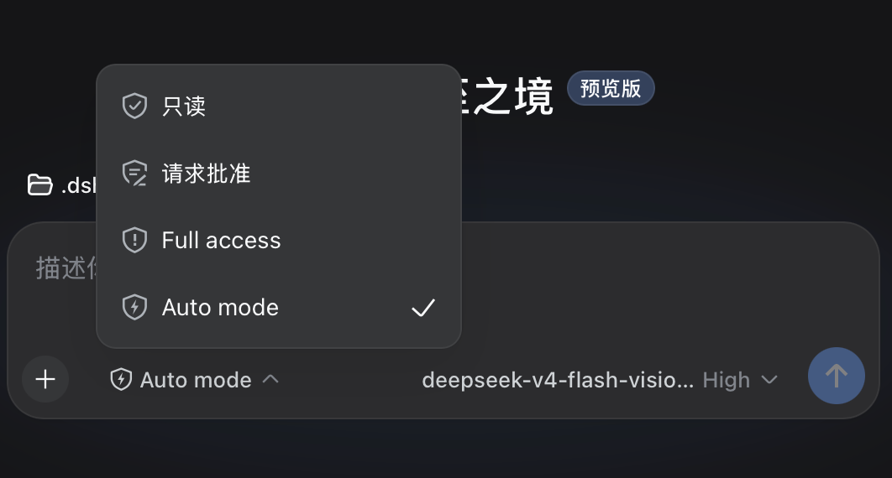

# dsh-automode

[](https://www.npmjs.com/package/@log.li/dsh-automode)
[](./LICENSE)

> 🌐 **简体中文**: [README.zh.md](./README.zh.md) · **English**: [README.md](./README.md)

面向 DeepSeek Harness 的 Claude Code 风格自动模式。

这是一个护栏（guardrail）插件。它在 agent 工具调用执行前进行拦截，阻止命中确定性 deny 规则、或 auto-mode 分类器判定为 block 的操作。

它**不是一个沙箱**。插件运行在 DSH 进程内，一个蓄意恶意的插件可以做你用户账户能做的任何事。用它来降低不安全的自主工具使用，而不是作为 OS 安全边界。

## 安装

```bash
dsh plugin add @log.li/dsh-automode
```

从本地 checkout：

```bash
dsh plugin add ./path/to/dsh-automode
```

安装后重启 `dsh web`。权限选择器（聊天框左下角）会显示 **Auto mode**，与只读 / workspace-write / danger-full-access 并列。

## 命令

```text
/auto           # 把本会话切换到 auto 模式
/auto-status    # 显示诊断：preset、审批策略、熔断器状态
```

## 工作原理

```text
工具调用到达
  │
  ├─ [pre-execute 门]（所有工具，第一道防线）
  │    ① 只读工具 → 放行（除非命中 deny）
  │    ② deny 规则（正则）→ 硬拒绝
  │    ③ allow 规则（前缀 glob）→ 放行
  │    ④ 工作区内文件操作 → 放行（allowInsideWorkingDirectory）
  │    ⑤ 升级意图 → 分类器预审
  │    ⑥ 其余 → 放行
  │
  └─ [approval 瀑布]
       ① 散文 deny 规则 → 拒绝
       ② 散文 allow 规则 → 放行
       ③ 只读 allowlist → 放行
       ④ 裁决缓存命中 → 复用（不二次调用 LLM）
       ⑤ 分类器（两阶段：one-token 预筛 → 结构化裁决）
       ⑥ 失败 → fail-closed
```

pre-execute 门拦截**所有**工具调用（包括工作区沙箱内、本来不会触发 approval 瀑布的那些）。approval 瀑布只对真正需要沙箱升级的调用运行。pre-execute 门**仅对 auto-mode 会话生效**；在其他 preset（read-only / workspace-write / danger-full-access）下它是 no-op，不会与你所选沙箱冲突。

## 规则

规则体系分两层：

### 硬边界（确定性，永不进分类器）

- **`deny`** — 正则模式，硬拒绝。首个匹配生效。在所有检查之前求值。用于加密外泄、密钥、敏感目标、危险命令。
- **`allow`** — 前缀 glob 模式，不调用任何 LLM 直接放行。在 deny 之后求值。用于你完全信任的常规命令。

### 分类器引导（散文，喂给 LLM）

- **`rules.deny`** — 软拒绝描述。分类器把它们视为常驻拒绝。可被用户直接意图或匹配到的 allow 规则覆盖。
- **`rules.allow`** — 软放行例外。分类器把它们视为常驻放行，会覆盖匹配的软拒绝规则。
- **`rules.environment`** — 上下文事实（受信仓库、基础设施、云存储桶）。分类器据此判断某动作是否在用户环境内。

所有 `rules.*` 数组都支持 **`$defaults`**：用 `["$defaults", "my custom rule"]` 保留内置规则并添加你自己的；省略 `$defaults` 则整个用你的替换内置列表。

## 配置

配置写在 profile 的 `cordis.patch.yml`。一切都有默认值，裸 `{}` 配置也合法。

```yaml
- id: auto-mode
  name: dsh-automode
  config:
    # --- 硬边界 ---

    deny:
      - exfiltrat
      - 'curl\s+[^|]*\|\s*(?:ba)?sh'
      - authorized_keys
      # ... 正则模式

    allow:
      - 'trash *'
      - 'echo *'
      - 'git status'
      - 'ls*'
      # ... 前缀 glob

    readOnlyTools:
      - read
      - glob
      - grep
      - list
      - search

    allowPaths:
      - '~/Documents/'
      - '/tmp/'

    allowInsideWorkingDirectory: true

    # --- 分类器 ---

    classifier:
      provider: ''             # 为空 = 跟随会话当前模型（request header）
      model: ''                # 为空 = 跟随会话当前模型（request header）
      maxTranscriptMessages: 40
      maxTokens: 2048
      temperature: 0
      reasoningLevel: low      # low / medium / high
      askFallback: false       # true = 三态（allow/ask/reject）

    rules:
      deny: ['$defaults']
      allow: ['$defaults']
      environment: ['$defaults']

    # --- 运行时 ---

    failClosed: true           # 分类器失败时拒绝
    preExecuteGate: true       # 启用 pre-execute 门
    timeoutMs: 45000           # 分类器调用硬超时
    classifyContextChars: 6000 # 任务对齐的上下文字符预算
    maxArgsChars: 4000         # 裁决缓存 key 命令签名的字符预算
    breakerConsecutive: 3      # 连续 DENY 触发熔断
    breakerTotal: 20           # 总 DENY 触发熔断
```

### 关键选项

| 选项 | 默认 | 说明 |
|---|---|---|
| `deny` | 内置列表 | 正则模式，硬拒绝。首个匹配生效。 |
| `allow` | 内置列表 | 前缀 glob，不调用 LLM 放行。 |
| `readOnlyTools` | read, glob, grep, list, search | 默认放行的工具（除非命中 deny）。 |
| `allowPaths` | `[]` | 全信任的外部目录（curated）。 |
| `allowInsideWorkingDirectory` | `true` | 工作区内文件操作不经分类器。 |
| `classifier.provider` / `classifier.model` | `''`（跟随会话） | 覆盖分类器 LLM 路由。解析顺序：`classifier.{provider,model}` → 会话当前模型（request header）→ agent 配置模型。为空时分类器用会话正在使用的模型。 |
| `classifier.askFallback` | `false` | `true`：分类器 "ask" → 人工询问。`false`："ask" → 拒绝。 |
| `classifier.reasoningLevel` | `low` | 传给分类器的推理强度（`reasoningEffort`）。若路由不支持该 effort 则回退（重试不传）。 |
| `rules.deny` | `['$defaults']` | 分类器软拒绝散文。 |
| `rules.allow` | `['$defaults']` | 分类器软放行散文。 |
| `rules.environment` | `['$defaults']` | 分类器环境事实。 |
| `failClosed` | `true` | 分类器失败时拒绝，vs. 回退到审批链。 |
| `preExecuteGate` | `true` | 启用 pre-execute 门（仅 auto-mode 会话生效）。 |
| `timeoutMs` | `45000` | 分类器 LLM 调用的单次硬超时。 |
| `classifyContextChars` | `6000` | 给分类器的任务对齐上下文字符预算。 |
| `maxArgsChars` | `4000` | 裁决缓存 key 用的命令签名字符预算。 |
| `breakerConsecutive` | `3` | 连续分类器 DENY 触发熔断。 |
| `breakerTotal` | `20` | 总分类器 DENY 触发熔断。 |

### 权限预设图标



`auto-mode` 权限预设会在权限选择器里显示一个 ⚡ 图标。你可以通过改它的 `icon` 设置自己的 logo——该字段位于**预设**（`cordis.patch.yml` 的 `permission` 行，不是 `auto-mode` 自身配置），是一个画在共享盾牌轮廓内的 SVG 路径：

```yaml
- id: permission
  config:
    presets:
      auto-mode:
        sandbox: workspace-write
        approval: ask
        name: Auto mode
        description: ...
        icon: '<你的-svg-path-d>'   # 默认 bolt：'M9.15 3.4L5.85 8.55H7.95L7.05 12.6L10.45 7.25H8.25L9.15 3.4Z'
```

**是否显示**。选择器只有在 DSH 读取预设 `icon` 时才会绘制它。原生 DSH 硬编码了一个小的 glyph 映射，对 host 配置的预设不显示图标，因此该字段在那里会被静默忽略。你**不需要改 DSH 源码仓库、也不需要新增任何插件**——它只是一个被"支持预设 icon 的 DSH"消费的声明（某个读取预设 `icon` 的发布版，或对你这台机器运行的 DSH 打一次小补丁）。

图标只是外观——无论是否渲染，auto mode 行为完全一致。如果你不设 `icon`，插件默认是 bolt；在原生 DSH 上预设只显示标签。

### 两阶段分类器

分类器用两阶段把 LLM 成本降到最低：

1. **One-token 预筛**（~1 token）：让 LLM 只回一个数字（0 = 安全，1 = 需审查）。使用宽松的 token 预算和鲁棒的数字解析，避免 reasoning 模型被饿死，并把 `classifier.reasoningLevel` 作为推理强度传入。大多数常规动作返回 0 直接跳过阶段 2。
2. **结构化裁决**：仅当阶段 1 标记时才运行。返回完整 verdict 及理由。

这意味着大多数工具调用只产生 ~1 token 的分类器开销，只有边界情况才 incur 完整分类器成本。

### 熔断器

当分类器在会话内连续拒绝 3 个动作、或累计 20 个时，熔断器跳闸，auto 模式暂停。approval 瀑布转交人工 answerer。**任何一次真实人工决策（允许或拒绝该动作）都会恢复 auto 模式并清零所有计数器**——人工参与即打破熔断器要抓的静默连拒循环。若用户取消请求、或没有可用 answerer，熔断器保持跳闸。

在熔断器跳闸的瞬间，插件会注入一段提示，告诉模型在**下一次尝试就直接请求 `danger-full-access` 沙箱升级**（立即弹出人工批准窗口），而不是"先以当前权限试一次 → 命中 denied → 再升级"的多余往返。

分类器失败（超时、解析错误、空响应）**不计入**熔断器。

### 拒绝引导与诊断

当一个动作被拒绝时，模型会被告知尝试更安全方案。若**没有更安全方案存在**，则指示其**停止重试并询问用户明确许可**——被拒绝的动作会一直失败，只有用户明确批准，后续尝试才可能通过（分类器经 `<recent_user_intent>` 权衡用户的最近显式意图）。

分类器失败会写入 DSH 日志（而非 decisions 日志），带出解析后的路由（`provider/model`）、底层错误 code/message、以及模型原始输出。这让反复出现的 `classifier returned no verdict` 可诊断——常见原因是分类器继承了会话的重推理模型，其 chain-of-thought 吃掉了分类器 token 预算（或免费/慢网关超时）。

### 裁决缓存

分类器 verdict 按会话的 tool + 命令签名缓存。若同一动作再次请求（例如 approval 瀑布在一次 pre-execute 分类之后），缓存 verdict 直接复用，不再二次 LLM 调用。缓存条目 5 分钟后过期。

## 日志

所有决策写入 `~/.dsh/auto-mode/decisions.jsonl`（JSONL 格式，append-only，跨重启保留）。每条记录包含：

- `at` — ISO 时间戳
- `event` — decision / pre-execute-deny / pre-execute-allow / breaker / resume / boot
- `outcome` — allowed-once / rejected / cancelled
- `tool` — 工具名
- `tier` — deny / allow / classify:monitor / classify:cache / classify:fail / ...
- `detail` — 人类可读理由
- `sessionId` — 会话标识

用复盘脚本分析日志、识别规则优化机会：

```bash
node scripts/auto-mode-review.mjs
```

## 系统提示影子化

当 auto 模式激活时，插件会"影子化"审批策略的系统提示，让模型看到 "auto" 而不是 "ask"。这告诉模型：工具拒绝来自自动化审查者，而非人类。模型会相应调整重试策略（尝试更小/更安全动作，而不是问用户）。

## 架构

```text
src/
  index.ts         主入口：preset 管理、审批 answerer、熔断器复位、命令、系统提示影子化
  config.ts        配置 schema + $defaults 机制 + 内置规则列表
  bands.ts         确定性频带引擎（deny 正则 + allow glob）
  pre-execute.ts   pre-execute 门（第一道防线；真实路径信任、分类器预审、熔断跳闸提示）
  classifier.ts    两阶段分类器（+ 鲁棒解析、推理强度、诊断）
  rules.ts         分类器散文规则匹配
  prompt.ts        分类器提示构造（<recent_user_intent> + 意图加权）
  cache.ts         裁决缓存（跨强制点共享）
  breaker.ts       熔断器（3 连续 / 20 总）
  log.ts           共享 appendDecision JSONL 日志器
```

## 许可证

[MIT](./LICENSE)
